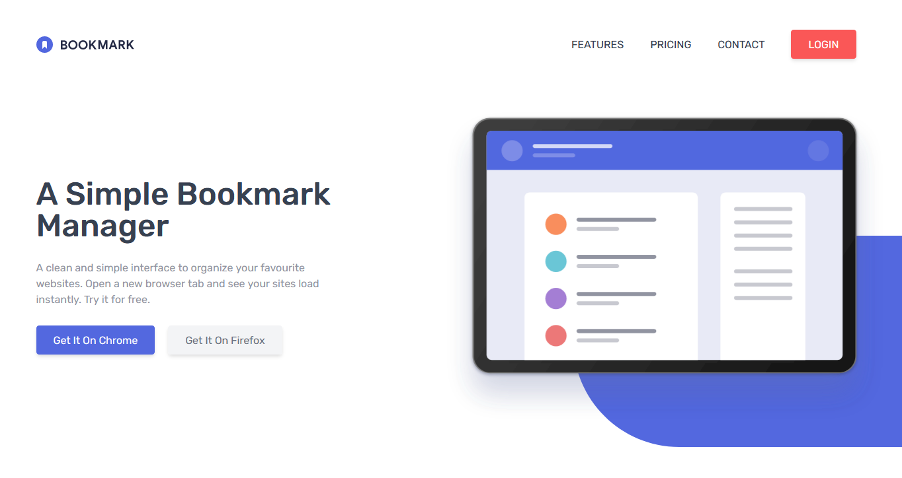

# Frontend Mentor - Bookmark landing page solution

This is a solution to the [Bookmark landing page challenge on Frontend Mentor](https://www.frontendmentor.io/challenges/bookmark-landing-page-5d0b588a9edda32581d29158). Frontend Mentor challenges help you improve your coding skills by building realistic projects. 

## Table of contents

- [Overview](#overview)
  - [The challenge](#the-challenge)
  - [Screenshot](#screenshot)
  - [Links](#links)
- [My process](#my-process)
  - [Built with](#built-with)
  - [Useful resources](#useful-resources)
- [Author](#author)

## Overview

### The challenge

Users should be able to:

- View the optimal layout for the site depending on their device's screen size
- See hover states for all interactive elements on the page
- Receive an error message when the newsletter form is submitted if:
  - The input field is empty
  - The email address is not formatted correctly

### Screenshot

### Links

- Solution URL: [check now :globe_with_meridians:](https://www.frontendmentor.io/solutions/bookmark-landing-page-solved-with-tailwind-and-alpinejs-5Aku-nqFs)
- Live Site URL: [check now :globe_with_meridians:](https://fahimanzamdip.github.io/bookmark-landing-page/)

## My process

### Built with

- [Tailwindcss](https://tailwindcss.com/) - CSS Framework
- [Apline.Js](https://github.com/alpinejs/alpine) - JS Framework

### Useful resources

- [Tailwindlabs - Youtube](https://www.youtube.com/channel/UCOe-8z68tgw9ioqVvYM4ddQ) - This channel helped me with learning tailwind css.
- [Andre Madarang](https://www.youtube.com/watch?v=2pQ_WDqXkWs) - This video by Andre Madarang helped me with getting started with apline js.

## Author

- Website - [Fahim Anzam Dip](https://fahim.codes)
- Frontend Mentor - [@FahimAnzamDip](https://www.frontendmentor.io/profile/FahimAnzamDip)
